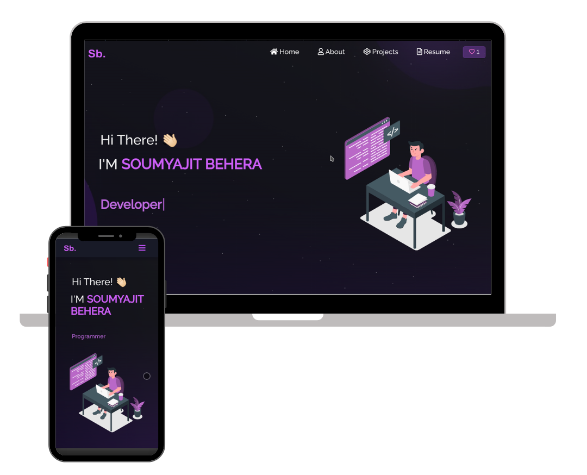

# Portfolio Website - v3.0

## [View Live Demo](https://saad-bhatti.github.io/soumyajit4419Portfolio/)

<!-- Demo Image -->

  

<!-- Badges -->

   &nbsp;
   &nbsp;
   &nbsp;
   &nbsp;
  

<!-- Action buttons -->
<h3 align="center">
  <a href="https://github.com/saad-bhatti/soumyajit4419Portfolio/issues">Report a Bug</a>
  🔹
  <a href="https://github.com/saad-bhatti/soumyajit4419Portfolio/issues">Request a New Feature</a>
</h3>

## Overview

This repository provides a fully customizable template for building personal portfolio websites. It includes a sleek, multi-page layout showcasing projects, technical skills, and more. The template is designed with React.js, making it easy for developers to adapt it to their own portfolios.

Whether you're a developer, designer, or anyone needing an online portfolio, this template offers a responsive and visually appealing foundation to highlight your work and skills.

## Built With

This portfolio template is built using modern web technologies, ensuring scalability, performance, and ease of customization. Below are the key technologies used:

- **React.js**: A JavaScript library for building user interfaces.
- **CSS3**: For styling the portfolio with custom themes.
- **React-Bootstrap**: A library for responsive, reusable components.
- **GitHub Pages**: For hosting and deploying the portfolio.
- **GitHub Actions**: For automating tasks like testing and deployment.
- **Jest**: JavaScript testing framework for ensuring code quality.
- **Code Climate**: For maintaining code quality and test coverage.

## Features

This portfolio template includes several useful features to help you showcase your work effectively:

- **📖 Multi-Page Layout**: Clean and well-structured pages for showcasing your projects, resume, and contact information.
- **🎨 Easy Customization**: Built with React-Bootstrap and CSS, allowing users to easily change colors, styles, and layout.
- **📱 Fully Responsive**: Optimized for different devices, including mobile, tablet, and desktop.
- **✉️ Contact Form**: A functional contact form allowing visitors to reach out directly via email.
- **🚀 Fast and Lightweight**: Built with performance in mind, ensuring fast load times.
- **✅ Tested with Jest**: Comes with unit tests to ensure code quality.
- **🌐 Easy Deployment**: Quickly deploy your portfolio to GitHub Pages for free hosting with minimal configuration.

## Documentation

This repository includes additional guides to help you set up and customize the portfolio to your needs. You can find the detailed documentation in the `docs/` folder, including:

- **Installation and Setup Guide**: Step-by-step instructions for cloning, installing, and running the application locally.
- **File Structure**: Detailed explanation of the project’s file organization and how to navigate the codebase.
- **Customization Guide**: A comprehensive guide on how to modify the template to match your personal style and content.

Check the `docs/` folder for all necessary details!

## Show your support

If you enjoy using this template, please consider giving it a ⭐ to show your support!

You can also buy me a coffee if you'd like to support the work:

