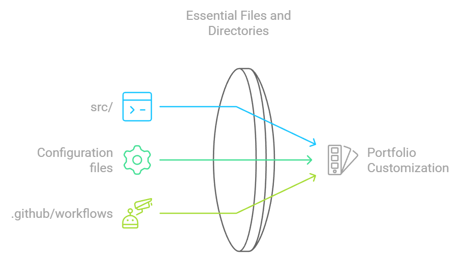

# File Structure Overview

This document outlines the structure of the project and provides brief descriptions of the key directories and files.

The directories and files in **bold** are the ones you will likely interact with and modify for customization purposes. They contain the source code and configuration settings necessary to personalize the portfolio template to suit your needs.

<!-- File Structure Image -->

  

## Root Directory

- **.github/workflows/**: Contains configuration files for GitHub Actions workflows.
  - *code_climate.yml*: Configuration for Code Climate integration to upload test coverage reports.
  - **main_deploy.yml**: Workflow file for deploying the project to GitHub Pages.

- *coverage/*: Stores code coverage reports generated by tests *(created after running tests)*.

- *docs/*: Contains project documentation.
  - *file_structure.md*: This file, providing an overview of the project's file structure.
  - *setup.md*: Instructions for installing and setting up the project.

- *images/*: Holds images used in the project for its markdown files and index.html.
  - *customization.png*: Diagram for the customization markdown file.
  - *file_structure.png*: Diagram for the file structure markdown file.
  - *readme.png*: A demo image showcasing the portfolio on a laptop and mobile device.
  - *screenshot.png*: Another image used to demonstrate the layout of the portfolio's home page.
  - *setup.png*: Diagram for the setup markdown file.

- *node_modules/*: Contains project dependencies installed via npm *(created after installing dependencies)*.

- **public/**: Includes static assets like HTML and images served by the application.
  - *404.html*: Custom 404 page for handling routing errors.
  - **favicon.png**: The small icon displayed in the browser tab.
  - **index.html**: The main HTML file that React injects the app into.
  - *manifest.json*: Contains metadata about the web app for Progressive Web App (PWA) support.
  - *robots.txt*: Tells search engine crawlers which pages to index or avoid.

- **src/**: Contains all the source code of the application (detailed later).

- *.gitignore*: Specifies files and directories to be ignored by Git, preventing them from being tracked.

- *.markdownlint.json*: Linter configuration for Markdown files.

- *.prettierignore*: Specifies files and directories that Prettier should ignore.

- *.prettierrc*: Configuration file for Prettier, the code formatter.

- *jest.config.js*: Configuration file for Jest, the testing framework.

- **package.json**: Defines project metadata, dependencies, scripts, and more.

- *README.md*: Project overview documentation.

## Source Directory (src/)

- *tests/*: Contains unit tests for testing components of the application.
  
- **assets/**: Contains static assets such as images, project logos, and the resume used throughout the portfolio.
  
- **components/**: Contains React components that make up different sections of the website.
  
  - **About/**: Holds components related to the "About" section of the portfolio.
    - **AboutMe.js**: Displays personal details about the user.
    - **GithubContributions.js**: Visualizes the user's GitHub contributions using the GitHub calender.
    - *TechStack.js*: Displays the technologies used by the user.
    - *ToolStack.js*: Displays the tools the user is proficient in.

  - **Contact/**: Holds components related to the "Contact" section.
    - **AlternativeContact.js**: Provides an alternative way to contact the user through social links.
    - *ContactForm.js*: A functional form allowing visitors to contact the user via email.

  - **Home/**: Contains components that display the homepage content.
    - **Greeting.js**: A greeting and interested roles for the homepage.
    - **Introduction.js**: Introduces the portfolio and its contents.

  - *Projects/*: Contains components that display project-related information.
    - *ProjectCard.js*: Displays individual project details.
  
  - *Footer.js*: Contains the footer section of the website.
  
  - *Navbar.js*: Contains the navigation bar of the website.
  
  - *Particle.js*: Adds particle animation to the site.
  
  - *Preloader.js*: Adds a preloading animation for when the page is loading.
  
  - *ScrollToTop.js*: Component to scroll the page to the top.

- **data/**: Contains essential configuration and content files for customizing the portfolio.
  - **emailJSData.js**: Contains the configuration for integrating the email service used in the contact form.
  - **interestedRoles.js**: Lists the roles or positions the owner is interested in.
  - **navBarItems.js**: Defines the navigation bar items.
  - **projectData.js**: Contains details for displaying each project in the portfolio.
  - **sideActivities.js**: Lists additional activities or hobbies of the owner.
  - **socialIcons.js**: Defines the social media icons and links.
  - **techStackData.js**: Stores the technologies the portfolio owner is skilled in.
  - **toolStackData.js**: Lists the tools used by the portfolio owner.

- *pages/*: Contains the main page/section components for routing.

- *styles/*: Holds CSS/SCSS files for styling the website.

- **App.js**: The main component that renders and controls the application.
  
- *index.js*: The entry point for the React app, rendering the app component to the DOM.
  
- *reportWebVitals.js*: Used to measure the performance of the application.
