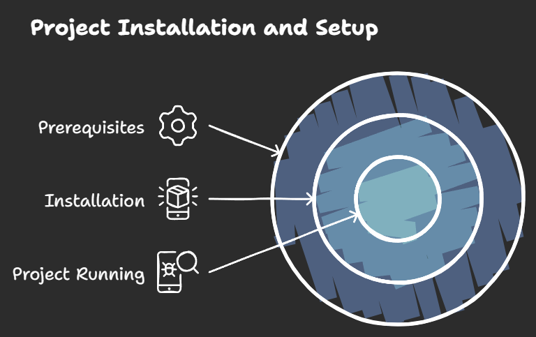

# Installation and Setup

This document provides instructions for installing and setting up the project on your local machine. Follow the steps below to get started.

<!-- Setup Image -->
<div align="center">
  
</div>

## Prerequisites

Before you begin, make sure you have the following installed on your machine:

- **Node.js** (version 12 or higher) - [Download Node.js](https://nodejs.org/)
- **Git** - [Download Git](https://git-scm.com/)

## Starting the Application

1. **Clone the repository**:

    ```bash
    git clone https://github.com/saad-bhatti/soumyajit4419Portfolio.git portfolio
    ```

2. **Navigate into the project directory**:

    ```bash
    cd portfolio
    ```

3. **Install dependencies**:

    ```bash
    npm install
    ```

4. **Start the development server**:

    ```bash
    npm start
    ```

    The application will be accessible at [http://localhost:3000/soumyajit4419Portfolio](http://localhost:3000/soumyajit4419Portfolio). The page will automatically reload if you make edits to the code.

## Testing the Application

This project uses Jest for unit testing. To run the tests, use the following command:

```bash
npm test
```
